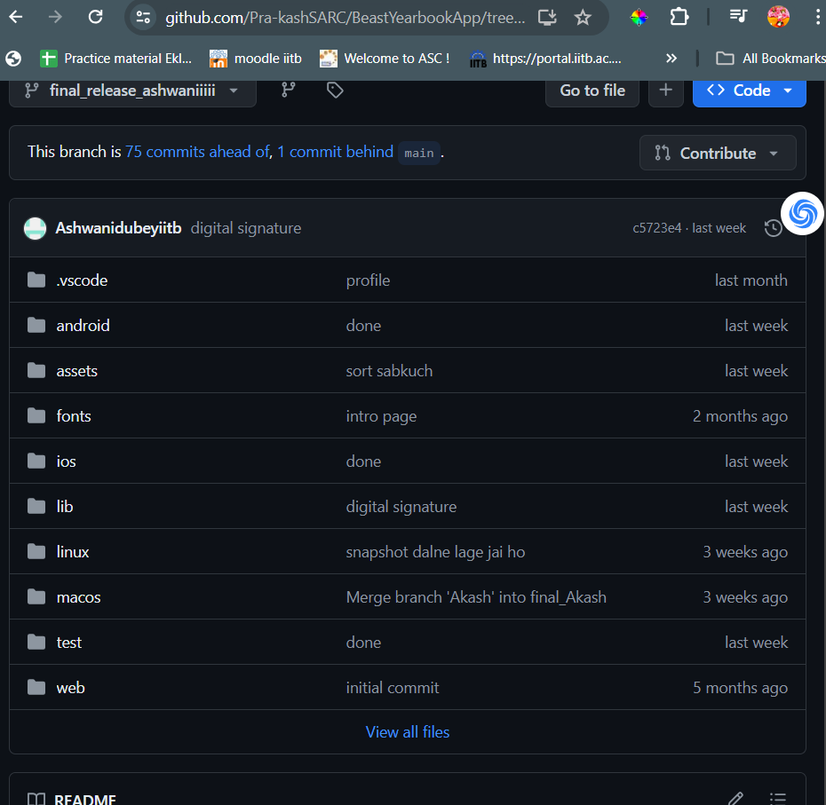
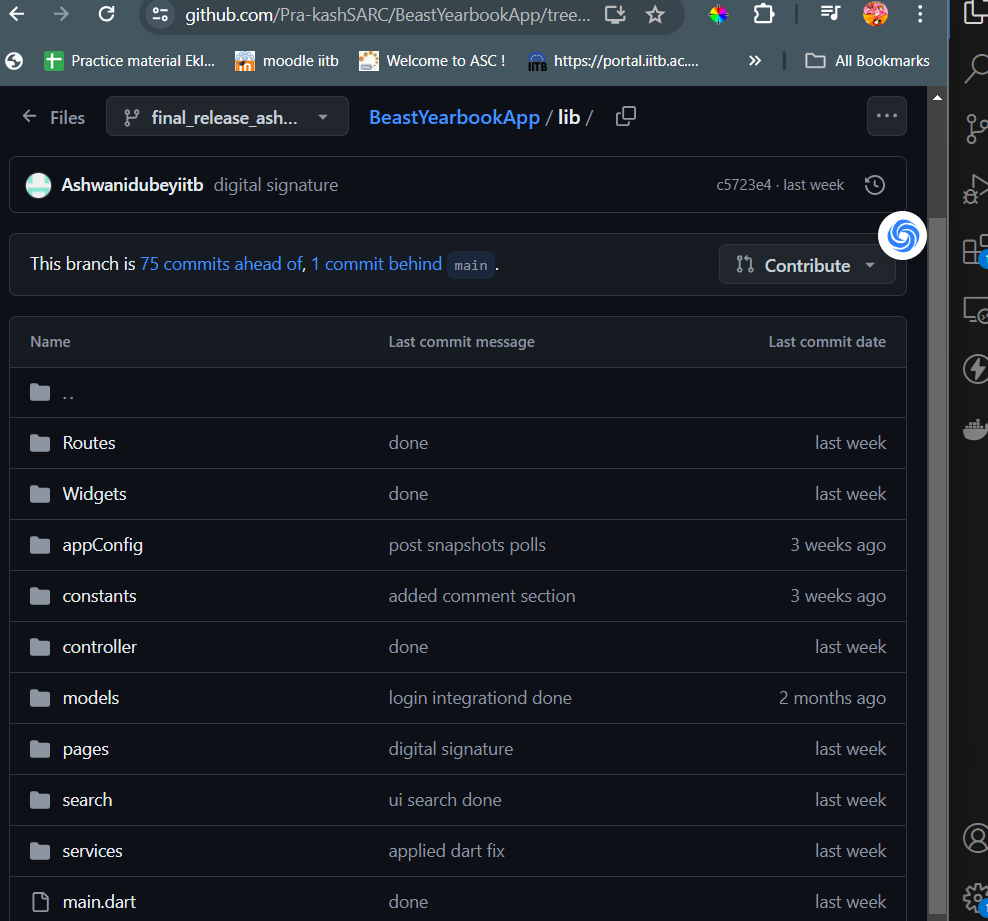
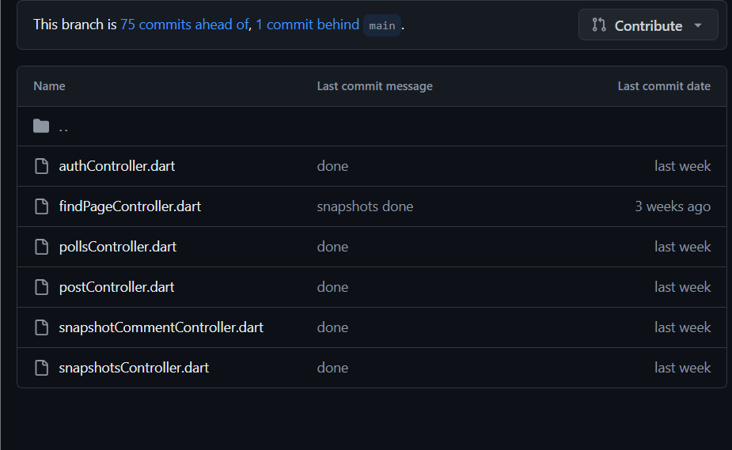

# Yearbook Clone App

This repository contains a clone of the Yearbook'24 app for IIT Bombay. The original app is used by around 6000 users, has 1.4 crore impressions, 23k posts, and over 6000 snapshots uploaded. This is the first time in the history of any IIT that such an app has been created.

Due to confidentiality, the original Yearbook repo is private, and its code cannot be made public. However, this repository serves as a demonstration of the core features and structure of the original app.

## Features

- **Controllers**: Created for various APIs similar to context hooks.
- **Models**: Includes models for profile, posts, users, etc.
- **UI Integration**: Designed and integrated with the existing backend.
- **Authentication**: Uses JSON Web Tokens for authentication.
- **Deployment**: Deployed app bundle signed and published on Play Store and App Store.
- **Packages**: Utilizes over 20 packages or dependencies.

## Project Structure

The project includes the following controllers which interact with backend APIs:

- `search_controller.dart`
- `profile_controller.dart`
- `post_controller.dart`
- `snapshot_controller.dart`
- `polls_controller.dart`
- `auth_controller.dart`

## Screenshots

Below is a screenshot of the original private repository (not included due to privacy issues):







## Backend

The backend for this app is shared with my React.js based website: [Yearbook SARC IITB](https://yearbook.sarc-iitb.org/)

## Getting Started

To run this project locally, follow these steps:

1. **Clone the repository**:
    ```bash
    git clone https://github.com/Ashwanidubeyiitb/yearbook_clone.git
    ```

2. **Navigate to the project directory**:
    ```bash
    cd yearbook_clone
    ```

3. **Install dependencies**:
    ```bash
    flutter pub get
    ```

4. **Run the app**:
    ```bash
    flutter run
    ```

## Dependencies

The project uses several dependencies. Here are a few key ones:

- `http`
- `provider`
- `flutter_bloc`
- `json_annotation`

## Note

This project is a clone and does not contain the full code of the original Yearbook app due to privacy issues.

## License

This project is licensed under the MIT License - see the [LICENSE](LICENSE) file for details.

## Contact

For any inquiries or questions, please contact me at [ashwani.sarc@gmail.com](mailto:ashwani.sarc@gmail.com).

---

*This project is for educational purposes only and is not an official release of the Yearbook'24 app.*
